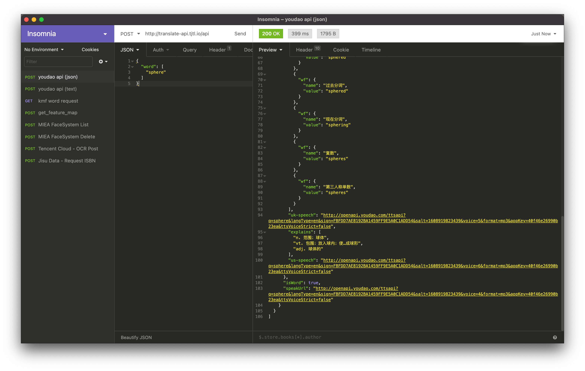
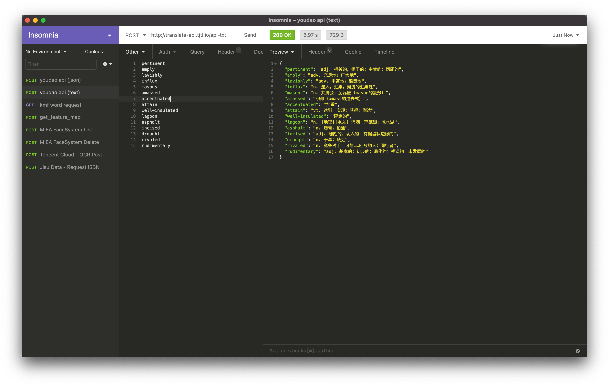

# Batch Translator for English Vocabulary

A tool for batch translating english vocabulary into Chinese. 

## Getting started

1. You must register your own appKey and appSecret on Youdao API platform;
2. Make sure you have acquired your appKey from [here](https://ai.youdao.com/DOCSIRMA/html/自然语言翻译/API文档/文本翻译服务/文本翻译服务-API文档.html) and paste the `appKey` to `config.js`;
2. `node app.js [your appSecret]`

## Todo:

- [ ] CSV export
- [ ] Provide interface, enable user to paste multiple lines of words and get result at the same webpage
- [x] Post data in `text/plain` format (multiple lines)
- [x] Post data in `application/json` format

